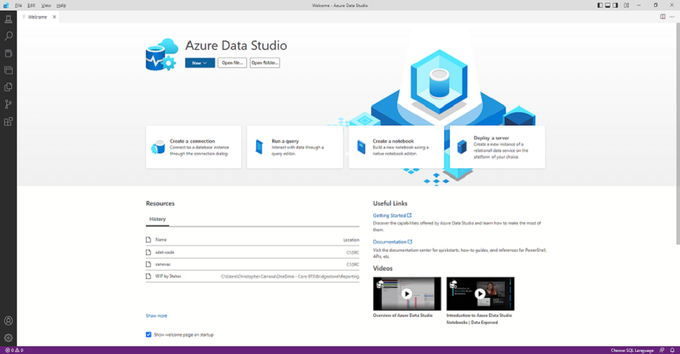
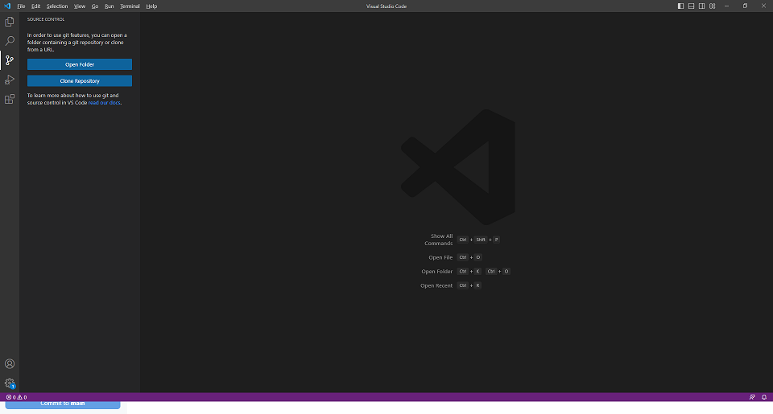
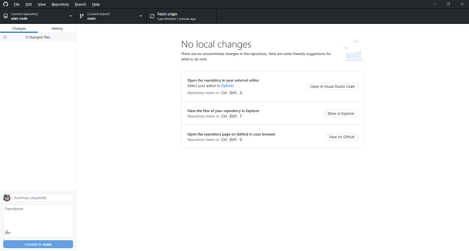

# sdet-code
This repo should be located at [https://github.com/cavonac/sdet-code.git](https://github.com/cavonac/sdet-code.git)

The purpose of this repository is to provide a novice **software development engineer in test** (SDET) with content for self-studying programming and data langauges. SDETs have a hybrid skillset which includes testing, programming (or software development), DevOps, and database administration. SDETs typically create test automation to improve the development-test-release software cycle.

## In This Repo

| Link | Description |
| ---- | ----------- |
| .gitignore | A gitignore file specifies intentionally untracked files that Git should ignore. This is useful for keeping local copies of config files for modification between environments or clients.
| README.md | You can add a README file to a repository to communicate important information about your project. A README communicates expectations for your project and helps you manage contributions.
[SQL Learning Notebook](SqlLearning.ipynb) | Example SQL queries to understand and possibly execute with some setup required.
|[Python Programming Notebook](PythonProgramming.ipynb) | Python notebook with example definitions (sames as methods, functions, operations, etc.) for various tasks along with some sample PyTests.
| [Python - Fibonacci](test_fibonacci.py) | Sample Python code to create and verify numbers of the Fibonacci sequence
| [Python - String Challenge](test_string_challenges.py) | Example linear search algorithm and test cases
| [Python - Web Requests](test_web_requests.py) | First look at real-world testing for OWASP recommended headers on owasp.org

## Recommended Links
| Link | Description |
| ---- | ----------- |
| [Python.com](https://www.python.org/) | Python is a programming language that lets you work more quickly and integrate your systems more effectively. Some data structures include <i>lists</i>, <i>dictionaries</i>, <i>tuples</i>, and <i>sets</i>. 
| [Python cheatsheet](https://perso.limsi.fr/pointal/_media/python:cours:mementopython3-english.pdf) | Cheatsheet on Python (2 pages). 
| [Download Git](https://git-scm.com/downloads) | Source control management (SCM) application that synchronizes local files and folders with a central remote repository using a modern branching model to create, merge, or delete lines of code in development.
| [Azure Data Studio (ADS)](https://aka.ms/azuredatastudio) | A cross-platform database tool for data professionals using on-premises and cloud data platforms with IntelliSense, code snippets, source control integration, and an integrated terminal. It's engineered with the data platform user in mind, with built-in charting of query result sets and customizable dashboards. 
| |
| [Download Visual Studio Code (Code)](https://code.visualstudio.com/Download) | Visual Studio Code is a streamlined code editor with support for development operations like debugging, task running, and version control. 
| |
| [GitHub Desktop](https://desktop.github.com) | Simplifies your development workflow using Git
| | 
| [Git Cheatsheet](https://training.github.com/downloads/github-git-cheat-sheet/) | Refer to the basic Git commands used often
|[SQL Server Central](https://www.sqlservercentral.com/articles/getting-comfortable-writing-code-in-azure-data-studio) | Getting comfortable writing code in Azure Data Studio
| [Markdown Syntax](https://www.markdownguide.org/basic-syntax) | Guide for authoring text using markdown (like this README.md file)
| [PyTest](https://www.pytest.org/) | To use, run 'pytest' from a command line and it should automatically find tests and run them from console. Installation may be required: <code>pip install -U pytest</code>. 
| [OWASP](https://owasp.org) | Open Web Application Security Project is a nonprofit foundation that works to improve the security of software.

# Contributions
Contributing to this repo is welcomed in forms of issues or code. Create a separate branch and merge your code contribution to **main** with a Pull Request.